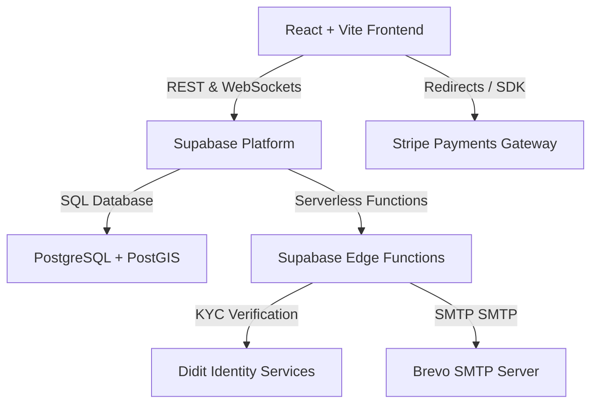

# Architecture Overview

This document provides a high-level overview of the architectural components, data flows, and design decisions behind the Ausaguide application.

---

## 1. High-Level Architecture

Ausaguide is structured as a client-side Single Page Application (SPA) communicating directly with a serverless Backend-as-a-Service (BaaS) layer:

---

## 2. Core Subsystems

### A. Authentication & User Security
- **Mechanism**: Supabase Auth (JSON Web Tokens saved client-side).
- **Two-Factor Authentication (2FA)**: Leverages TOTP (Time-based One-Time Passwords). The server-side stores encrypted secrets (`two_factor_secret`) and backup codes within `public.profiles`. The client verifies verification codes via time window comparisons before enabling authentication sessions.

### B. Database Schema & Geospatial Queries
- **Database Engine**: PostgreSQL.
- **Geospatial Features**: Powered by **PostGIS**.
  - Geographic coordinates of host application logs and active guides are parsed as spatial points (`WGS 84 / SRID 4326`).
  - Search proximity queries rely on indexing spatial columns with a **GIST index** to support rapid `ST_DWithin` calculations (finding guides within a 50km radius).
- **Row Level Security (RLS)**: Enforced globally. Non-administrative users cannot bypass client-level table policies; updates and deletes verify that `auth.uid() = owner_id`.

### C. Serverless Edge Functions
- **Runtime**: Deno execution environment inside Supabase.
- **Roles**:
  - `export-user-data`: aggregates user data across profiles, bookings, messages, posts, and journals.
  - `delete-user-data`: purges records from database and auth schemas.
  - `stripe-webhook`: handles payment intents and payout updates.
  - `verify-identity`: triggers Didit session initializations.

### D. Payments & Payout Routing (Stripe Connect)
- **Model**: Custom Express / Standard Connected Accounts.
- **Flow**:
  - Traveler pays for a booking using Stripe Checkout.
  - Stripe routes funds, automatically deducting the platform commission fee, and sends the remaining amount to the guide host connected account.
  - Success events are captured by webhook handlers to transition booking states to `confirmed`.
